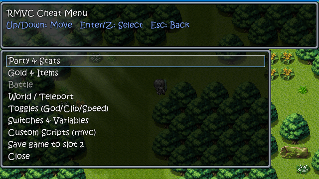
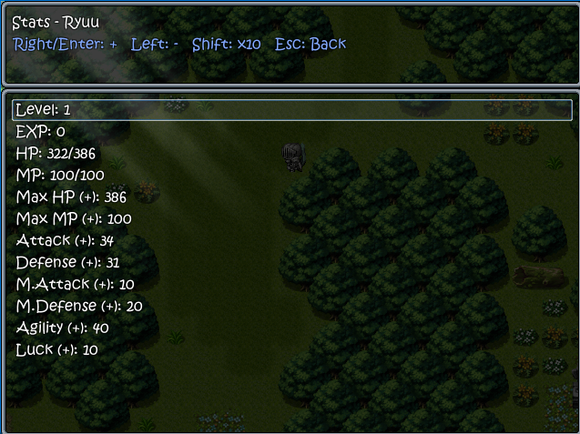
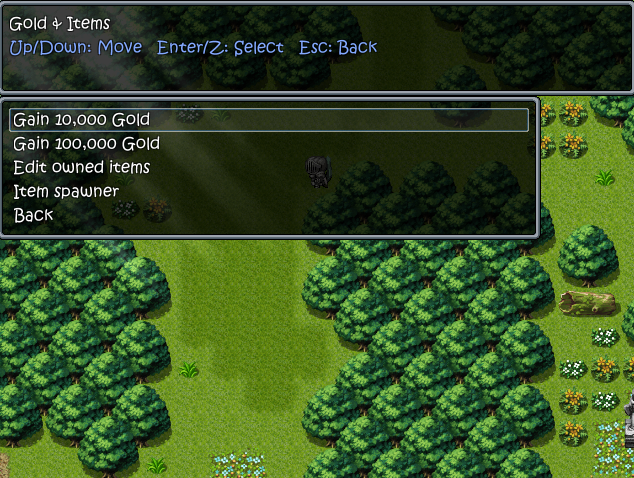
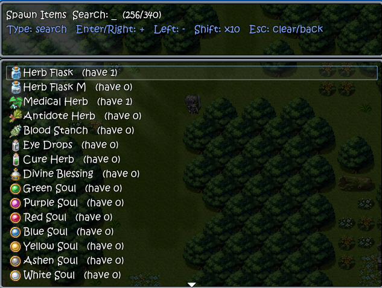
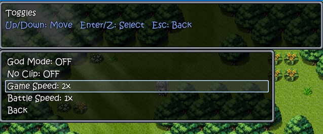

# RPG Maker VX Ace Cheat Toolkit

An in-game cheat menu for RPG Maker VX Ace games. A small Windows patcher
decrypts the game, injects a Ruby cheat module into the game's scripts, and
repacks it. In game, press **CTRL + C** to open a navigable cheat menu.

<p align="center">
  
</p>

This is a clean rewrite of [allape/RPG-Maker-ACE-Cheater](https://github.com/allape/RPG-Maker-ACE-Cheater):
same script-injection approach, but with an in-game GUI instead of hotkeys, and
with the archive decryption and `Scripts.rvdata2` patching reimplemented in pure
Go — so the patcher is a single executable with no runtime dependencies (no
third-party binaries, no Ruby on PATH).

## How it works

The patcher is a single, dependency-free `.exe` — everything below is done in
pure Go, in-memory:

1. **Decrypt** `Game.rgss3a` to loose files (Go RGSSAD v1/v3 extractor). The
   archive is renamed to `Game.rgss3a~` so the game runs from the extracted
   files.
2. **Patch** the Scene_Base script inside `Data/Scripts.rvdata2`: the Marshal
   stream is walked to find Scene_Base's deflated code, which is inflated, the
   cheat module (`cheat/*.rb`) is prepended and `RMVC.update` inserted at the
   start of `Scene_Base#update`, then re-deflated and spliced back. Every other
   script is preserved byte-for-byte.

At runtime, `RMVC.update` watches for **CTRL + C** (via Win32
`GetKeyboardState`). When pressed it opens a modal RGSS3 window overlay and takes
over the update loop, so the underlying scene is frozen while you cheat.

## Requirements

- **To run the patcher:** Windows. Nothing else — no Ruby, no external tools.
- **To build the patcher:** [Go](https://go.dev/) 1.21+.

## Build

```bash
# Windows
build.bat

# Any host (cross-compile)
./build.sh
```

Produces `RPG-Maker-ACE-Cheater-Patcher.exe`.

## Usage

Put the patcher in the game folder (next to `Game.exe`) and run it. Pick an
operation from the menu:

- **Patch** — install the cheat menu.
- **Restore** — revert to the original (renames `Game.rgss3a~` back, removes the
  unpacked scripts).
- **Re-patch** — restore then patch (e.g. after updating the cheat code).

You can also point it at another folder and/or skip the menu:

```bash
RPG-Maker-ACE-Cheater-Patcher.exe "C:\path\to\game" patch
RPG-Maker-ACE-Cheater-Patcher.exe "C:\path\to\game" restore
RPG-Maker-ACE-Cheater-Patcher.exe "C:\path\to\game" repatch
```

## In-game cheat menu

Open / close with **CTRL + C**. Navigate with the **arrow keys**, confirm with
**Enter / Z / Space**, go back / close with **Esc**. Every action shows a
feedback toast in the banner, and errors are caught and reported instead of
crashing the game. (Input is read from physical keys, so it works even if the
game remaps RPG Maker's logical controls.)

| Menu | Actions |
| --- | --- |
| **Party & Stats** | Heal & revive all party · Set all party HP to 1 · **Stat editor** (per-actor: Level, EXP, HP/MP, and all 8 params) · **State editor** (per-actor: add/remove/toggle any buff, debuff, or condition) · **Skill editor / spawner** (per-actor: learn/forget/toggle any skill) |
| **Gold & Items** | Gain 10,000 / 100,000 gold · **Edit owned items** · **Item spawner** (every item / weapon / armor in the database, straight into your inventory) |
| **Battle** (in battle only) | Kill all enemies · Set enemies HP to 1 · Heal all enemies |
| **World / Teleport** | **Teleport to any map** (full map list) · **Teleportation slots** (10 numbered, named waypoints — Enter teleports / captures, Right saves, Left clears; used slots confirm before teleport/overwrite/clear) |
| **Toggles** | **God Mode** (party takes no damage / can't die) · **No Clip** (walk through walls) · **No Encounters** (disable random battles) · **Game Speed** 1–4× · **Battle Speed** 1–4× · **Damage Multiplier** 1–100× · **EXP Multiplier** 1–100× |
| **Switches & Variables** | Browse & toggle switches · Browse & edit variables |
| **Custom Scripts** | Run `rmvc.q.rb` / `rmvc.w.rb` / `rmvc.e.rb` · Reload them |
| **Save** | Save game to slot 2 |

In list editors (items, spawner, variables, stats): **→ / Enter** increases,
**←** decreases, hold **← / →** to repeat, and hold **Shift** for the larger
step (×10, or ×100 for variables).
On the toggles page, speed and multiplier rows also support **← / →**,
hold-to-repeat, and **Shift** for larger steps. Search lists use **Esc** to
clear/back so letters such as `x` can be typed even if the game maps them to
cancel.

Toggle cheats apply continuously even when the menu is closed. Game/Battle speed
work by scaling the engine frame rate (Battle Speed only ramps up inside
battles); they reset to normal when set back to 1×.

### Screenshots

<p align="center">
  
  
</p>
<p align="center">
  
  
</p>

### Custom scripts (`rmvc.*.rb`)

Drop `rmvc.q.rb`, `rmvc.w.rb`, or `rmvc.e.rb` in the **game root folder**. The
matching menu entry `eval`s the file in the cheat context (so `$game_party`,
`$game_map`, etc. are available). Use **Reload** after editing. Errors in these
scripts are caught and shown in the feedback banner instead of crashing.

## Notes & limitations

- VX Ace only (RGSSAD v3 / `.rgss3a`). The decrypter also handles v1
  (`.rgssad` / `.rgss2a`) but VX Ace is the tested target.
- Avoid running the patcher from a path with non-ASCII characters.
- The in-game module relies on the VX Ace Ruby runtime (RGSS301) APIs; it does
  not run standalone.

## Credits

- Original concept & cheat logic: [allape/RPG-Maker-ACE-Cheater](https://github.com/allape/RPG-Maker-ACE-Cheater)
- RGSSAD format reference: [uuksu/RPGMakerDecrypter](https://github.com/uuksu/RPGMakerDecrypter)
- Keyboard polling approach: Hime_AllKey
